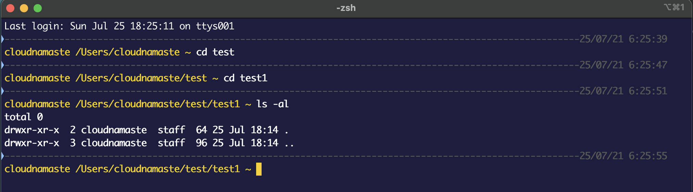

# Customized Prompt
Add content from CustomizedPrompt.txt to your .zshrc file

OLD_PS1="%F{yellow}%n %d ~ "

```
%F{yellow} - Yellow font color
%n         - Username
%d         - Current directory
```


PS1=$'%B%F{240}${(r:$COLUMNS-20::-:)}%D{%f/%m/%y} %D{%L:%M:%S}\n''%B%F{white}$OLD_PS1%F{white}'
```
%B%F{240} - Bold Grey Font color

${(r:$COLUMNS-20::-:)} - Insert '-' 

%D{%f/%m/%y} %D{%L:%M:%S} - Formatted Date at end of line of dashes

%B%F{white}$OLD_PS1%F{white} - Bold font before Prompt and Normal Font after prompt
````




## Login Information

%M - Full hostname

%m - Hostname up until the first dot

%n  Username of logged in user
## Shell State Information

%? - Show the return code from the previous executed command

%d Current directory

%~ - Current directory, use “~” if home directory

%h - History event line number (alternative: %! )

%C - Trailing directory of the Current Directory

%D - Current date in YY-MM-DD format

%T - Current time in 24-hours format (HH:MM)

%t - Current time in 12-hour format (HH:MM) with AM/PM

%* - Current time in 24-hour format with seconds

%w - Current date in day-DD format

%W  Current date in MM/DD/YY format

%D{string} - Current date/time formatted based in {string}
Example: PROMPT=’%D{%a}’
Common Formats:

```
%a = Day of week abbreviation
%A = Full day of week name
%w = day of the week (0-6)

%d = day of the month (01-31)

%b = Abbreviated month name
%B = full month name
%m = Month (00-12)

%y = Year (00-99)
%Y = Year (4 digits)

%H = Hour (00-23)
%k = Hour (0-23)
%I = Hour (01-12)
%l = Hour (1-12)

%M = Minute (00-59)

%S = Seconds (00-59)

%p = AM or PM
%P = am or pm
```